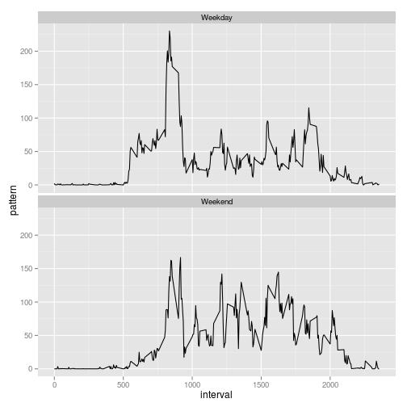

# Reproducible Research: Peer Assessment 1

## Introduction

It is now possible to collect a large amount of data about personal movement using activity monitoring devices such as a [Fitbit](http://www.fitbit.com/home), [Nike Fuelband](http://www.nike.com/us/en_us/c/nikeplus-fuelband), or [Jawbone Up](https://jawbone.com/up). These type of devices are part of the “quantified self” movement – a group of enthusiasts who take measurements about themselves regularly to improve their health, to find patterns in their behavior, or because they are tech geeks. But these data remain under-utilized both because the raw data are hard to obtain and there is a lack of statistical methods and software for processing and interpreting the data.

This assignment makes use of data from a personal activity monitoring device. This device collects data at 5 minute intervals through out the day. The data consists of two months of data from an anonymous individual collected during the months of October and November, 2012 and include the number of steps taken in 5 minute intervals each day.


## Loading and preprocessing the data

Firstly check the data is in the `./data` directory if not download the data:


```r
appFiles <- list.files("data")
if("activity.csv" %in% appFiles){
  download.file("http://d396qusza40orc.cloudfront.net/repdata%2Fdata%2Factivity.zip"
                , "data/activity.zip")
  unzip("data/activity.zip", exdir = "data")
}
```

Now the data is present in `.csv` form in the `data` directory. The data can be loaded into `R` using the `read.csv` function. We define a bespoke date class to handle the formatting upon read. The data is then passed into the `data.table` package.


```r
setClass('myDate')
setAs("character", "myDate", function(from) as.Date(from, format="%Y-%m-%d") )

activityData <- read.csv("data/activity.csv", colClasses = c("numeric", "myDate", "integer"))
library(data.table)
activityData <- data.table(activityData)
```


## What is mean total number of steps taken per day?

The variable `activityData` contains the fitness data. The function `complete.cases` from the `stats` package can be used to remove rows with `NA` values. Our requirement is to sum the number of steps by day or date:


```r
dailyData <- activityData[complete.cases(activityData)
                          , list(dailySteps = sum(steps)), by = date]
```

To make a histogram we use the `ggplot2` package with the geom `geom_bar`:


```r
library(ggplot2)
ggplot(dailyData, aes(x = date, y = dailySteps)) + geom_bar(stat = "identity")
```

 

Our data is now aggregated by day and we can use the `mean` and `median` functions from `base`:


```r
mean(dailyData$dailySteps)
```

```
## [1] 10766
```

```r
median(dailyData$dailySteps)
```

```
## [1] 10765
```

## What is the average daily activity pattern?

To compute the average daily activity we again remove the `NA`'s from our data using `complet.cases` and this time use the `mean` function on our step data grouping by interval:


```r
dailyAverage <- activityData[complete.cases(activityData)
                          , list(pattern = mean(steps)), by = interval]
```

This can be plotted as a timeseries using the `ggplot2` package and `geom_line` `geom`.


```r
ggplot(dailyAverage, aes(x = interval, y = pattern)) + geom_line()
```

 

To find the interval that contains on average the maximum number of steps we can use the 
`which.max` function to identify the index of the maximum from our patterns then use this index on our intervals:


```r
dailyAverage$interval[which.max(dailyAverage$pattern)]
```

```
## [1] 835
```

## Imputing missing values

To sum the number of rows with `NA` in our data we again use `complete.case` function. We negate the returned vector which indicate which rows have NA's then we sum.


```r
sum(!complete.cases(activityData))
```

```
## [1] 2304
```


Next we investigate the instances of `NA` among the columns of our data:


```r
sapply(lapply(activityData, is.na), sum)
```

```
##    steps     date interval 
##     2304        0        0
```

So `NA`'s only occur in the step data. The way we will handle the `NA`'s is to replace the `NA` value with the mean number of steps for that interval across our data.


```r
activityDataCopy <- copy(activityData)
activityDataCopy <- activityDataCopy[, steps := ifelse(is.na(steps), mean(steps, na.rm = TRUE), steps)
                                     , by = interval]
```

Carry out the same daily analysis as previously on our imputed dataset. We use the `ggplot2` package with `geom_bar` to create the histogram:


```r
dailyStepsReplace <- activityDataCopy[, list(dailySteps = sum(steps)), by = date]
ggplot(dailyStepsReplace, aes(x = date, y = dailySteps)) + geom_bar(stat = "identity")
```

 

```r
mean(dailyStepsReplace$dailySteps)
```

```
## [1] 10766
```

```r
median(dailyStepsReplace$dailySteps)
```

```
## [1] 10766
```

Replacing the missing values by the mean value for that interval results in the same mean value as previously the median however has increased.  

## Are there differences in activity patterns between weekdays and weekends?

We check our data and see if it is on a weekday or not using the `weekdays` function and checking if the result is a `Saturday` or `Sunday`:


```r
activityDataCopy[,weekday := ifelse(weekdays(date) %in% c("Saturday", "Sunday"), "Weekend", "Weekday")]
```

```
##          steps       date interval weekday
##     1: 1.71698 2012-10-01        0 Weekday
##     2: 0.33962 2012-10-01        5 Weekday
##     3: 0.13208 2012-10-01       10 Weekday
##     4: 0.15094 2012-10-01       15 Weekday
##     5: 0.07547 2012-10-01       20 Weekday
##    ---                                    
## 17564: 4.69811 2012-11-30     2335 Weekday
## 17565: 3.30189 2012-11-30     2340 Weekday
## 17566: 0.64151 2012-11-30     2345 Weekday
## 17567: 0.22642 2012-11-30     2350 Weekday
## 17568: 1.07547 2012-11-30     2355 Weekday
```

```r
activityDataCopy[, is.weekday := as.factor(weekday)]
```

```
##          steps       date interval weekday is.weekday
##     1: 1.71698 2012-10-01        0 Weekday    Weekday
##     2: 0.33962 2012-10-01        5 Weekday    Weekday
##     3: 0.13208 2012-10-01       10 Weekday    Weekday
##     4: 0.15094 2012-10-01       15 Weekday    Weekday
##     5: 0.07547 2012-10-01       20 Weekday    Weekday
##    ---                                               
## 17564: 4.69811 2012-11-30     2335 Weekday    Weekday
## 17565: 3.30189 2012-11-30     2340 Weekday    Weekday
## 17566: 0.64151 2012-11-30     2345 Weekday    Weekday
## 17567: 0.22642 2012-11-30     2350 Weekday    Weekday
## 17568: 1.07547 2012-11-30     2355 Weekday    Weekday
```

```r
activityDCPattern <- activityDataCopy[, list(pattern = mean(steps))
, by = list(interval, is.weekday)
]
```


Finally we make two separate activity pattern plots for weekday and weekend using `ggplot2`:


```r
ggplot(activityDCPattern, aes(x = interval, y = pattern)) + geom_line() + facet_wrap(~ is.weekday, nrow = 2)
```

 
